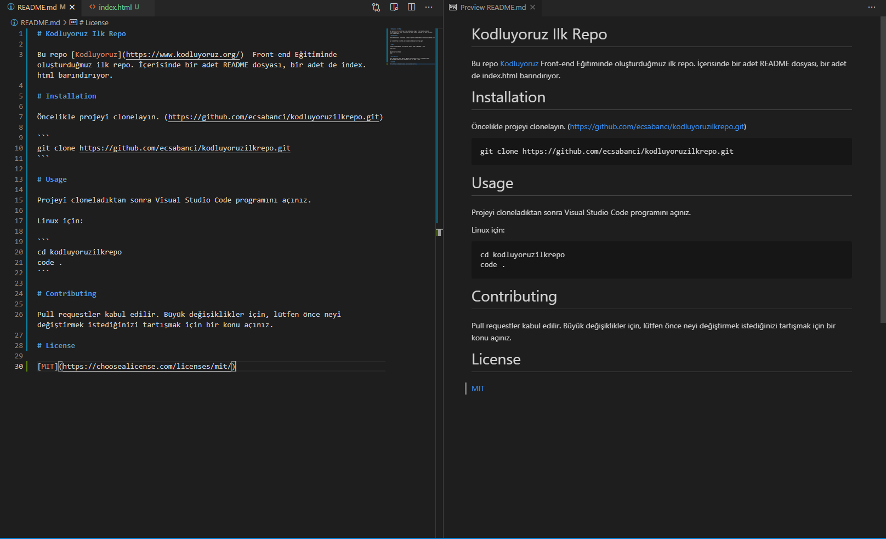

# Kodluyoruz Ilk Repo

Bu repo [Kodluyoruz](https://www.kodluyoruz.org/)  Front-end Eğitiminde oluşturduğmuz ilk repo. İçerisinde bir adet README dosyası, bir adet de index.html barındırıyor.



# Installation

Öncelikle projeyi clonelayın. (https://github.com/ecsabanci/kodluyoruzilkrepo.git)

```
git clone https://github.com/ecsabanci/kodluyoruzilkrepo.git
```

# Usage

Projeyi cloneladıktan sonra Visual Studio Code programını açınız.

Linux için:

```
cd kodluyoruzilkrepo
code .
```

# Contributing

Pull requestler kabul edilir. Büyük değişiklikler için, lütfen önce neyi değiştirmek istediğinizi tartışmak için bir konu açınız.

# License

[MIT](https://choosealicense.com/licenses/mit/)